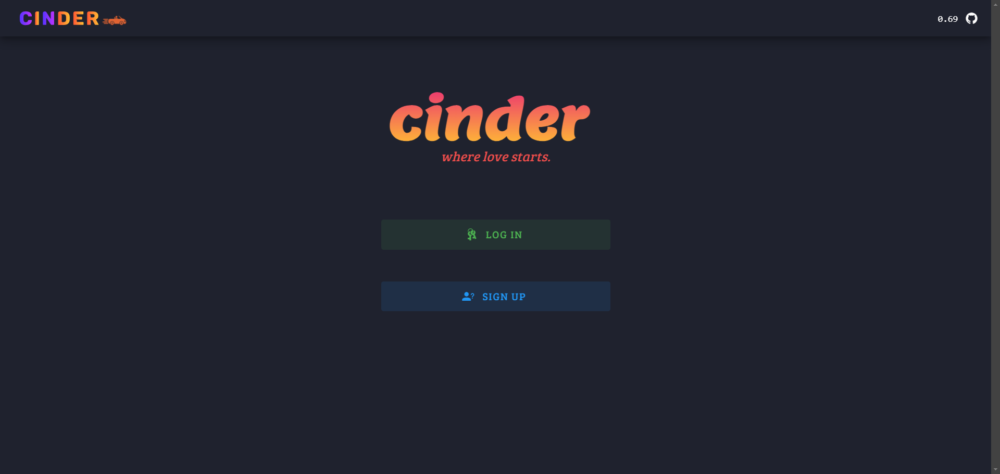
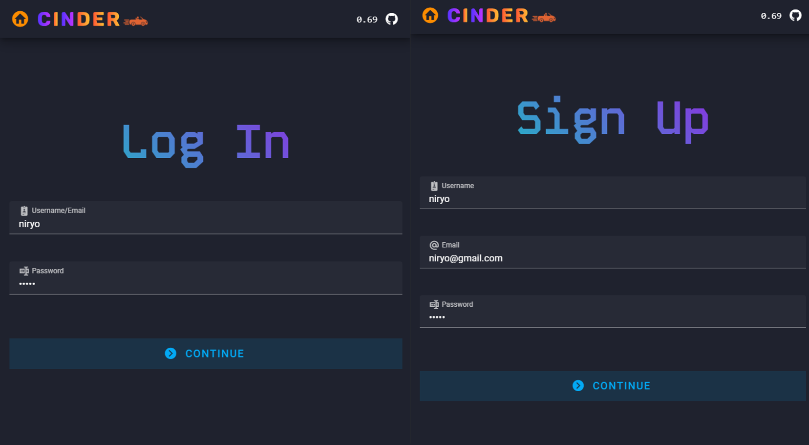
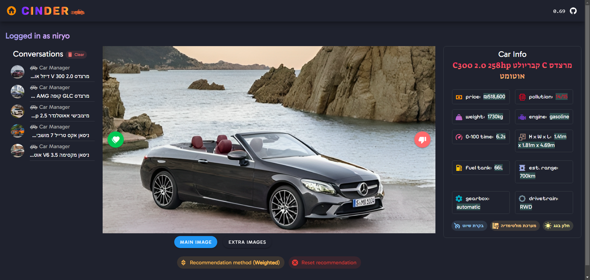
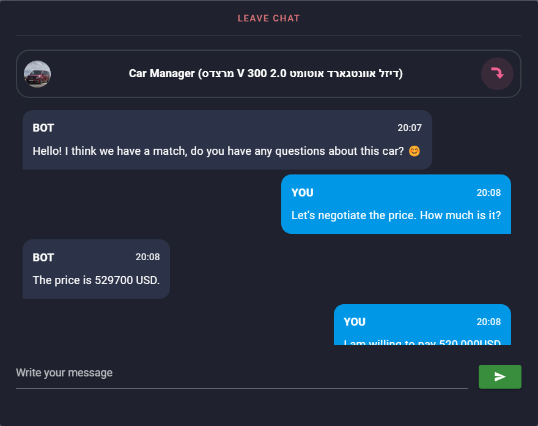

---------

*Looking for a fancy car but too lazy to go to the showroom?  
Tired of scrolling through car lists to find your next love?  
<b>Cinder is here to help you find your next car match!</b> 
Swipe cars until you meet your new babe ❤️‍🔥  *

## 🖼️ Preview

### 🏠 Home

### 🔐 Login & Signup

### 🔥 Swiping

### 💬 AI Chat

## 🏗️ Components

### 📺 Frontend (website)

- [X] home screen
- [X] login screen
- [X] signup screen
- [X] swiping screen
- [X] chat screen
- [X] scripts for api calls

### 💡 Backend (server)

- [X] authentication (user)
- [X] api endpoints
- [X] integration with the ML model
- [X] database
- [X] chatgpt chat

### 🎯 Recommendation System (ML)

- [X] data collection
- [X] data cleaning
- [X] data analysis
- [X] vector & cosine similarity based recommendation
  - [X] average based recommendation
  - [X] weighted average based recommendation
  - ... more recommendation methods ...

## 💡 Backend

- [ ] public/private key communication (custom made)